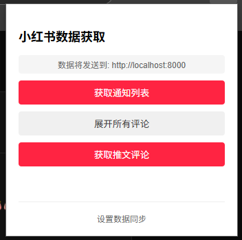

## 用户使用指南

以下是快速启动和使用本系统的步骤：

1. **安装浏览器插件**:

   - 前往 `xhs_chrome_plugin` 目录。
   - 打开你的 Chromium 内核浏览器（如 Chrome, Edge）的扩展管理页面。
   - 启用"开发者模式"。
   - 点击"加载已解压的扩展程序"，选择 `xhs_chrome_plugin` 文件夹。
   - 安装成功后，插件图标会出现在浏览器工具栏。
2. **安装 Docker**:

   - 如果你还没有安装 Docker，请前往 [Docker 官方网站](https://www.docker.com/products/docker-desktop/) 下载并安装 Docker Desktop。它包含了 Docker Engine 和 Docker Compose。
3. **设置后端环境变量**:

   - 进入 `xhs_backend` 目录。
   - 创建一个名为 `.env` 的文件。
   - **最少需要设置 API 密钥**。复制以下内容到 `.env` 文件中，并将 `your_secure_api_token_here` 替换为你自己生成的安全令牌（例如，一个长随机字符串）：
     ```dotenv
     # .env 文件 (位于 xhs_backend 目录下)
     API_SECRET_TOKEN="your_secure_api_token_here"

     # 其他配置项（如数据库地址、名称等）对于 Docker Compose 运行有默认值，
     # 如果需要自定义，可以参考 xhs_backend/README.md 中的完整示例。
     ```
   - **重要**: 这个 `API_SECRET_TOKEN` 需要与之后在插件设置中填写的令牌保持一致。
4. **启动服务 (使用 Docker Compose)**:

   - 回到项目的**xhs_backend 目录**（即包含 `docker-compose.yml` 文件的目录）。
   - 打开终端或命令提示符。
   - 运行以下命令来构建并以后台模式启动所有服务（后端、数据库、前端）:
     ```bash
     docker-compose up -d --build
     ```
   - `--build` 参数会确保在首次启动或代码有更新时构建最新的镜像。
   - `-d` 参数表示在后台运行。
5. **配置插件**:

   - 服务启动后（可能需要几十秒时间），右键点击浏览器工具栏中的插件图标，选择"选项"或"设置数据同步"。
   - **API 接口地址**: 默认应为 `http://localhost:8000/api/data` (这是后端服务的地址)。
   - **认证令牌 (Token)**: 填入你在第 3 步 `.env` 文件中设置的 `API_SECRET_TOKEN`。
   - 点击"保存设置"。
6. **开始使用**:

   - 在小红书网页版浏览评论或通知时，点击插件上的功能按钮，会把数据发送给后端服务
   - 你也可以通过 `docker-compose logs -f xhs_backend` 查看后端服务的日志，确认数据接收情况。


## 功能截图


